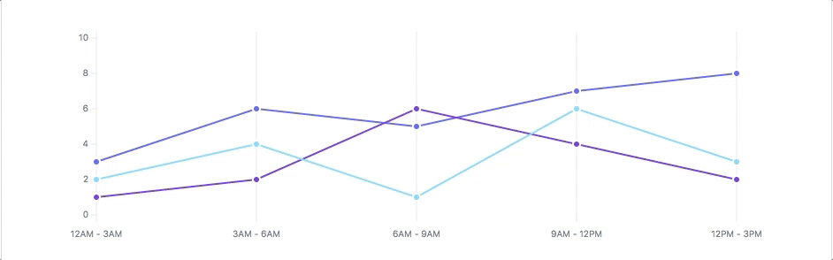

<div align="center">
    
    <a href="https://frappe.github.io/charts">
        <h2>Frappe Charts</h2>
    </a>
    <p align="center">
        <p>GitHub-inspired modern, intuitive and responsive charts with zero dependencies</p>
        <a href="https://frappe.github.io/charts">
            <b>Explore Demos » </b>
        </a>
        <a href="https://codepen.io/pratu16x7/pen/wjKBoq">
            <b> Edit at CodePen »</b>
        </a>
    </p>
</div>

<p align="center">
    <a href="https://travis-ci.org/frappe/charts">
        
    </a>
    <a href="http://github.com/frappe/charts/tree/master/dist/js/frappe-charts.min.iife.js">
        
    </a>
</p>

<p align="center">
    <a href="https://frappe.github.io/charts">
        
    </a>
</p>

### Contents
* [Installation](#installation)
* [Usage](#usage)
* [Contribute](https://frappe.io/charts/docs/contributing)
* [Updates](#updates)
* [License](#license)

#### Installation
* Install via [`npm`](https://www.npmjs.com/get-npm):

  ```sh
  $ npm install frappe-charts
  ```

  and include in your project:
  ```js
  import { Chart } from "frappe-charts"
  ```

  ...or include following for es-modules(eg:vuejs):
  ```js
  import { Chart } from 'frappe-charts/dist/frappe-charts.esm.js'
  // import css
  import 'frappe-charts/dist/frappe-charts.min.css'
  ```

* ...or include within your HTML

  ```html
    <script src="https://cdn.jsdelivr.net/npm/frappe-charts@1.1.0/dist/frappe-charts.min.iife.js"></script>
    <!-- or -->
    <script src="https://unpkg.com/frappe-charts@1.1.0/dist/frappe-charts.min.iife.js"></script>
  ```

#### Usage
```js
const data = {
    labels: ["12am-3am", "3am-6pm", "6am-9am", "9am-12am",
        "12pm-3pm", "3pm-6pm", "6pm-9pm", "9am-12am"
    ],
    datasets: [
        {
            name: "Some Data", type: "bar",
            values: [25, 40, 30, 35, 8, 52, 17, -4]
        },
        {
            name: "Another Set", type: "line",
            values: [25, 50, -10, 15, 18, 32, 27, 14]
        }
    ]
}

const chart = new frappe.Chart("#chart", {  // or a DOM element,
                                            // new Chart() in case of ES6 module with above usage
    title: "My Awesome Chart",
    data: data,
    type: 'axis-mixed', // or 'bar', 'line', 'scatter', 'pie', 'percentage'
    height: 250,
    colors: ['#7cd6fd', '#743ee2']
})
```

...or for es-modules (replace `new frappe.Chart()` with `new Chart()`):
```diff
- const chart = new frappe.Chart("#chart", {
+ const chart = new Chart("#chart", {  // or a DOM element,
                                    // new Chart() in case of ES6 module with above usage
    title: "My Awesome Chart",
    data: data,
    type: 'axis-mixed', // or 'bar', 'line', 'scatter', 'pie', 'percentage'
    height: 250,
    colors: ['#7cd6fd', '#743ee2']
})
```


If you want to contribute:

1. Clone this repo.
2. `cd` into project directory
3. `npm install`
4. `npm run dev`

#### Updates

##### v1.0.0
- Major rewrite out. Some new features include:
    - Mixed type axis datasets
    - Stacked bar charts
    - Value over data points
    - Y Markers and regions
    - Dot size, Bar space size, and other options
    - Legend for axis charts
- We would be looking to incorporate existing PRs and issues in the meantime.

##### Please read [#93](https://github.com/frappe/charts/issues/93) for v0.1.0 updates on rework and development.

##### v0.0.7
- [Custom color values](https://github.com/frappe/charts/pull/71) for charts as hex codes. The API now takes an array of colors for all charts instead of a color for each dataset.
- [@iamkdev's](https://github.com/iamkdev) blog on [usage with Angular](https://medium.com/@iamkdev/frappé-charts-with-angular-c9c5dd075d9f).

##### v0.0.5
- More [flexible Y values](https://github.com/frappe/charts/commit/3de049c451194dcd8e61ff91ceeb998ce131c709): independent from exponent, minimum Y axis point for line graphs.
- Customisable [Heatmap colors](https://github.com/frappe/charts/pull/53); check out the Halloween demo on the [website](https://frappe.github.io/charts) :D
- Tooltip values can be [formatted](https://github.com/frappe/charts/commit/e3d9ed0eae14b65044dca0542cdd4d12af3f2b44).

##### v0.0.4
- Build update: [Shipped](https://github.com/frappe/charts/pull/35) an ES6 module, along with the browser friendly IIFE.

##### v0.0.2
- We have an animated [Pie Chart](https://github.com/frappe/charts/issues/29)! Thanks [@sheweichun](https://github.com/sheweichun).
- [@tobiaslins](https://github.com/tobiaslins) contributed tweaks for his quest to make these easy to use with React. Check out his [repo](https://github.com/tobiaslins/frappe-charts-react-example) and updates at [#24](https://github.com/frappe/charts/issues/24) to learn more :)
- A new logo.

##### v0.0.1
- The very first version out, with animatable bars and lines, a percentage chart and a heatmap. GitHub-style.

#### License
This repository has been released under the [MIT License](LICENSE)

------------------
Project maintained by [Frappe](https://frappe.io).
Used in [ERPNext](https://erpnext.com). Read the [blog post](https://medium.com/@pratu16x7/so-we-decided-to-create-our-own-charts-a95cb5032c97).

